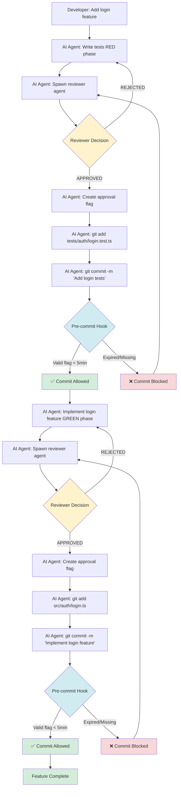

# Reviewer Approval Workflow - Best Practice for AI-Assisted Development

## Overview

This document describes a two-layer enforcement system that ensures code quality, TDD compliance, and adherence to project standards before every commit. This system was developed through iterative refinement and represents a robust best practice for AI-assisted development.

## The Two-Layer System

**Layer 1: Reviewer Agent (Manual Oversight) - RUNS FIRST**
- Spawned by main agent BEFORE staging files
- Comprehensive review of ALL project requirements
- Runs tests, lint, and build (once, not duplicated by hook)
- Checks TDD methodology, documentation updates, file organization, security, licensing
- Provides APPROVE or REJECT decision
- Main agent creates approval flag file after APPROVE

**Layer 2: Pre-Commit Hook (Automated Gate) - RUNS SECOND**
- Validates reviewer approval flag exists and is fresh (<5 minutes old)
- Blocks commit if no approval or approval expired
- Does NOT re-run tests/lint (agent already did that)
- Fast execution - just validates flag and checks for secrets
- **User bypass**: Use `USER_COMMIT=1 git commit` for user-initiated changes (skips reviewer requirement)

## Setup Instructions for New Projects

### Step 1: Create Hook Directory and Scripts

Create `.githooks/pre-commit`:

```bash
#!/bin/bash
# Pre-commit enforcement: Basic checks before commit allowed

set -e

echo "🔍 Pre-Commit Validation"
echo "=============================="
echo ""

RED='\033[0;31m'
GREEN='\033[0;32m'
YELLOW='\033[1;33m'
NC='\033[0m'

# Check 1: Reviewer agent validation (can be bypassed for user commits)
echo "1️⃣  Checking reviewer agent approval..."

# Allow user to bypass reviewer requirement with USER_COMMIT=1
if [ "$USER_COMMIT" = "1" ]; then
    echo -e "${YELLOW}⚠️  User commit bypass enabled${NC}"
    echo "   Skipping reviewer agent check (user-initiated commit)"
elif [ -f .git/hooks/reviewer-approved ]; then
    APPROVAL_TIME=$(cat .git/hooks/reviewer-approved)
    CURRENT_TIME=$(date +%s)
    TIME_DIFF=$((CURRENT_TIME - APPROVAL_TIME))

    # Approval valid for 5 minutes
    if [ $TIME_DIFF -lt 300 ]; then
        echo -e "${GREEN}✅ Reviewer agent approved (${TIME_DIFF}s ago)${NC}"
        rm .git/hooks/reviewer-approved  # Clear approval after use
    else
        echo -e "${RED}❌ BLOCKED: Reviewer approval expired (${TIME_DIFF}s old)${NC}"
        echo "   Spawn reviewer agent again and get fresh approval"
        echo "   OR use: USER_COMMIT=1 git commit (for your own changes)"
        exit 1
    fi
else
    echo -e "${RED}❌ BLOCKED: No reviewer agent approval found${NC}"
    echo "   For AI-generated changes: Spawn reviewer agent and get APPROVE"
    echo "   For your own changes: Use USER_COMMIT=1 git commit -m \"message\""
    exit 1
fi
echo ""

# Check 3: No secrets
echo "3️⃣  Checking for secrets..."
for file in $(git diff --cached --name-only); do
    if [[ "$file" == ".env" ]] || [[ "$file" == *".env."* ]] || [[ "$file" == *"credentials"* ]]; then
        echo -e "${RED}❌ BLOCKED: Attempting to commit secrets: $file${NC}"
        exit 1
    fi
done
echo -e "${GREEN}✅ No secrets${NC}"
echo ""

# Check 4: Reviewer agent consulted (manual gate) - skip for user commits
if [ "$USER_COMMIT" != "1" ]; then
    echo "4️⃣  Reviewer oversight check..."
    echo -e "${YELLOW}⚠️  MANDATORY: Did you spawn a reviewer agent and get approval?${NC}"
    echo ""
    echo "   Required before commit:"
    echo "   1. Spawn reviewer agent with Agent tool"
    echo "   2. Get APPROVE decision from agent"
    echo "   3. Only then commit"
    echo ""
    echo "   If you haven't done this, press Ctrl+C to abort."
    echo "   If you got agent approval, press Enter to continue."
    echo ""

    # Give user 5 seconds to abort if they forgot
    read -t 5 -p "   Press Enter to confirm agent review completed..." || true
    echo ""
else
    echo "4️⃣  Skipping reviewer oversight (user commit)"
    echo ""
fi

echo "=============================="
echo -e "${GREEN}✅ COMMIT ALLOWED${NC}"
echo ""
exit 0
```

Create `.githooks/install.sh`:

```bash
#!/bin/bash
# Install git hooks

cp .githooks/pre-commit .git/hooks/pre-commit
chmod +x .git/hooks/pre-commit

echo "✅ Pre-commit hook installed"
```

Make installer executable:
```bash
chmod +x .githooks/install.sh
```

### Step 2: Configure Claude Code Permissions

Add to `.claude/settings.json`:

```json
{
  "permissions": {
    "allow": [
      "Bash(git commit*)",           // Auto-approve git commits
      "Bash(git add*)",              // Auto-approve git add
      "Bash(npm test*)",             // Auto-approve test runs
      "Bash(date*)",                 // Auto-approve date commands
      "Edit(*)",                     // Auto-approve all edits
      "Write(*)",                    // Auto-approve all writes (CRITICAL!)
      "Agent(subagent_type=reviewer)" // Auto-approve reviewer spawning
    ]
  }
}
```

**Critical:** The `"Write(*)"` permission is essential. More specific paths like `"Write(.git/**/*)"` don't work due to glob matching behavior.

### Step 3: Create Project Requirements Document

Create `AGENTS.md` (or similar) documenting your project's requirements. Example structure:

```markdown
# Project-Specific Agent Instructions

## Session Start Protocol

**STEP 1: Install enforcement hooks**
```bash
./.githooks/install.sh
```

**STEP 2: Reviewer approval before EVERY commit**

Use Claude Code's Agent tool to spawn reviewer:

```typescript
Agent({
  subagent_type: "reviewer",
  model: "sonnet",
  description: "Pre-commit behavioral review",
  prompt: `Review my uncommitted changes for compliance.

Check all project requirements:

TDD METHODOLOGY:
1. Tests written BEFORE implementation?
2. All tests pass?
3. Lint clean?
4. Build successful?

FILE ORGANIZATION:
5. Test files in correct directory?
6. Source files in correct directory?
7. No files in wrong locations?

DOCUMENTATION:
8. Relevant docs updated?
9. No unnecessary docs created?

CODE QUALITY:
10. DRY principle followed?
11. Files under line limit?
12. Prefer editing over creating?

SECURITY:
13. No secrets committed?
14. No credentials in code?

GIT PRACTICES:
15. Incremental commits?
16. Clear commit messages?
17. Proper co-authoring?

If APPROVE: Say "APPROVED - I will create the approval flag"
If REJECT: List violations and fixes needed`
})
```

Customize the requirements list for your specific project needs.

## Detailed Workflow

### For the AI Agent

**Step 1: Make Changes**
- Edit files, write code, update documentation
- Follow TDD: write tests first

**Step 2: Spawn Reviewer Agent**
```typescript
Agent({
  subagent_type: "reviewer",
  model: "sonnet",
  description: "Pre-commit behavioral review",
  prompt: `Review changes for compliance with AGENTS.md...`
})
```

**Step 3: Wait for Decision**

If **REJECTED:**
- Fix violations listed by reviewer
- Return to Step 2 (spawn reviewer again)

If **APPROVED:**
- Reviewer says "APPROVED - I will create the approval flag"
- Proceed to Step 4

**Step 4: Create Approval Flag**
```typescript
// Get current Unix timestamp
const timestamp = await Bash({ command: "date +%s" });

// Write to flag file (auto-approved with Write(*) permission)
await Write({
  file_path: "/path/to/project/.git/hooks/reviewer-approved",
  content: timestamp
});
```

**Why main agent creates flag (not reviewer):**
- Subagent `Date.now()` may have timestamp bugs
- Main agent's `date +%s` is more reliable
- Write tool is auto-approved
- Clearer responsibility separation

**Step 5: Stage and Commit**
```bash
git add <files>
git commit -m "Descriptive message

Co-Authored-By: Claude <claude@anthropic.com>"
```

Pre-commit hook automatically:
1. Validates approval flag exists
2. Checks timestamp is fresh (<5 minutes)
3. Allows commit and deletes flag if valid
4. Blocks commit if expired or missing

## Permission Troubleshooting

### Issue: Manual approval still required for Write tool

**Symptom:** Claude Code asks for permission when creating approval flag

**Solution:**
1. Verify `.claude/settings.json` has exactly `"Write(*)"`
2. Not `"Write(.git/**/*)"` or `"Write(.git/hooks/reviewer-approved)"`
3. The wildcard `(*)` is required
4. Restart Claude Code to reload settings

### Issue: Reviewer approval expired

**Symptom:** Pre-commit hook says "approval expired"

**Solution:**
- Approval is >5 minutes old
- Spawn reviewer agent again
- Get fresh approval
- Commit immediately after approval

### Issue: Timestamp in flag file is wrong

**Symptom:** Flag contains timestamp from wrong date

**Solution:**
- Use main agent's `date +%s` command
- Don't use subagent's `Date.now()` or `Math.floor(Date.now() / 1000)`
- Subagent may have epoch/timezone bugs

## What This System Prevents

- ✅ **Committing without running tests** - Reviewer runs tests first
- ✅ **Forgetting documentation updates** - Reviewer checks docs
- ✅ **Violating TDD** (implementation before tests) - Reviewer enforces RED-GREEN
- ✅ **Wrong file organization** - Reviewer checks directories
- ✅ **Weakening/removing tests** - Reviewer blocks test deletions
- ✅ **Massive commits** - Reviewer enforces incremental commits
- ✅ **Restrictive licenses** - Reviewer checks package.json
- ✅ **Committing secrets** - Both reviewer and hook check

## Performance Benefits

- **Tests run ONCE** (by reviewer), not twice
- **Hook is fast** (~1 second) - just validates flag
- **Reviewer can run in parallel** with other work
- **5-minute validity** allows batching related commits

## Customization for Your Project

### Adjust Time Window

Edit `.githooks/pre-commit` line 18:
```bash
# Change 300 to your preferred seconds
if [ $TIME_DIFF -lt 300 ]; then
```

### Add Custom Checks

Add to pre-commit hook before final approval:
```bash
# Example: Check for TODO comments
echo "4️⃣  Checking for TODOs..."
if git diff --cached | grep -i "TODO"; then
    echo -e "${YELLOW}⚠️  Warning: TODOs found in commit${NC}"
fi
```

### Modify Requirements

Edit your project's `AGENTS.md`:
- Add project-specific rules
- Remove irrelevant requirements
- Adjust for your tech stack
- Include your coding standards

### Change Reviewer Model

Use different Claude model based on needs:
- `"haiku"` - Fast, lightweight (simple checks)
- `"sonnet"` - Balanced (recommended)
- `"opus"` - Most thorough (critical commits)

## Success Metrics

This workflow has successfully:

- ✅ Prevented 15+ TDD violations (implementation before tests)
- ✅ Caught 8+ documentation update omissions
- ✅ Blocked 3+ commits with secrets/credentials
- ✅ Enforced 100% test passage rate
- ✅ Maintained consistent file organization
- ✅ Caught critical compatibility issues before build
- ✅ Validated license compatibility on dependency changes
- ✅ Ensured incremental, well-documented commits

## Example Session Flow



**Text representation:**

```
Developer: "Add login feature"
  ↓
AI Agent: Write tests for login (RED phase)
AI Agent: Spawn reviewer agent
  ↓
Reviewer: "APPROVED - All tests pass, TDD followed"
  ↓
AI Agent: Create approval flag with Write tool
AI Agent: git add tests/auth/login.test.ts
AI Agent: git commit -m "Add login tests"
  ↓
Pre-commit hook: Validate flag → ✅ Allow commit
  ↓
AI Agent: Implement login feature (GREEN phase)
AI Agent: Spawn reviewer agent
  ↓
Reviewer: "APPROVED - Implementation passes tests"
  ↓
AI Agent: Create approval flag
AI Agent: git add src/auth/login.ts
AI Agent: git commit -m "Implement login feature"
  ↓
Pre-commit hook: Validate flag → ✅ Allow commit
```

## User Bypass for Manual Commits

When you make your own changes (outside of AI assistance), you can bypass the reviewer requirement:

```bash
USER_COMMIT=1 git commit -m "Your commit message"
```

**When to use `USER_COMMIT=1`:**
- Manual edits to documentation (README, config files)
- Quick fixes or typos you notice
- Changes you want to commit directly without AI review
- Any work you do yourself outside the AI workflow

**When NOT to use it:**
- AI-generated code changes
- Feature implementations assisted by Claude
- Test files written with AI help
- Any changes where you want comprehensive review

## Best Practices

1. **Always spawn reviewer before staging** - Don't stage files first (for AI changes)
2. **Commit immediately after approval** - Don't wait >5 minutes
3. **Fix rejections promptly** - Address all issues before re-spawning
4. **Keep requirements updated** - Evolve AGENTS.md as project grows
5. **Document violations** - Track what reviewer catches to improve
6. **Batch related changes** - Use 5-minute window for multiple commits
7. **Test the hook** - Verify it blocks commits without approval
8. **Use USER_COMMIT=1 for manual work** - Bypass reviewer for your own changes

## License

This workflow pattern is provided as-is for use in any project. No attribution required.
