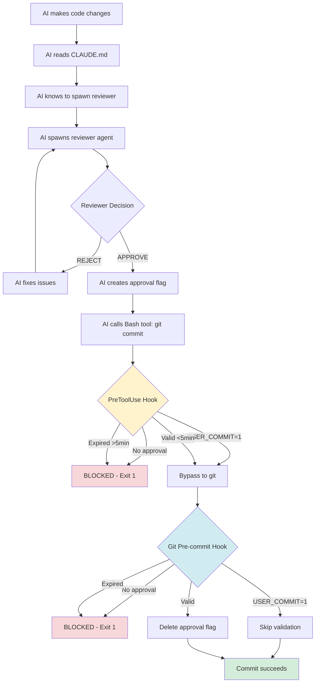

# Reviewer Agent Workflow

## Overview

Every commit requires reviewer agent approval to ensure code quality and compliance with project standards. This is enforced through **three layers of programmatic validation** (not just behavioral compliance).

---

## Three-Layer Enforcement Model

### Layer 1: PreToolUse Hook (Primary Enforcement)

**Location:** `.claude/settings.json` + `.claude/helpers/hook-handler.cjs`

**Trigger:** Before ANY `Bash` tool execution

**What it does:**
- ✅ Intercepts `git commit` **before** it runs
- ✅ Checks for approval flag existence
- ✅ Validates approval timestamp (<5 minutes)
- ✅ Allows `USER_COMMIT=1` bypass
- ✅ Provides clear error messages with instructions

**Implementation:**
```javascript
// In hook-handler.cjs pre-bash handler
if (cmd.includes('git commit')) {
  var userCommit = process.env.USER_COMMIT === '1';

  if (!userCommit) {
    var approvalFile = path.join(process.cwd(), 'reviewer-approved');

    // Check if approval file exists
    if (!fs.existsSync(approvalFile)) {
      console.error('[BLOCKED] No reviewer approval found');
      process.exit(1);
    }

    // Check if approval is fresh (<5 minutes)
    var approvalTime = parseInt(fs.readFileSync(approvalFile, 'utf8').trim(), 10);
    var currentTime = Math.floor(Date.now() / 1000);
    var timeDiff = currentTime - approvalTime;

    if (timeDiff >= 300) {
      console.error('[BLOCKED] Reviewer approval expired');
      process.exit(1);
    }
  }
}
```

**Advantages over pre-commit hook:**
- Catches missing approval **before** git commit starts
- Faster feedback (no git operations initiated)
- Works even if pre-commit hook is bypassed with `--no-verify`
- Provides clearer, more actionable error messages

### Layer 2: Pre-commit Hook (Secondary Validation)

**Location:** `.git/hooks/pre-commit`

**Trigger:** After `git commit` starts, before commit is finalized

**What it does:**
- ✅ Re-validates approval flag (defense in depth)
- ✅ Checks commit size (AI commits only: ≤5 files, ≤500 insertions)
- ✅ Checks for secrets in staged files
- ✅ Manual confirmation prompt
- ✅ Deletes approval flag after use (single-use)

**Why both layers:**
- Defense in depth - two independent checks
- Pre-commit hook can't be bypassed if PreToolUse fails
- Pre-commit hook cleans up approval flag
- Pre-commit hook checks secrets (different concern)

### Layer 3: Behavioral (AI Instructions)

**Location:** `CLAUDE.md` and `AGENTS.md`

**What it does:**
- Instructs AI to always run tests before committing
- Instructs AI to spawn reviewer agent
- Creates approval flag after reviewer approves

**Why still needed:**
- Ensures AI spawns reviewer proactively
- Hooks only validate, they don't trigger actions
- AI needs to know WHEN to spawn reviewer

---

## Pre-Commit Requirements (Enforced by Hooks)

Before ANY commit is allowed, all of these checks must pass:

### 0. Commit Size (AI commits only — hard block)

The pre-commit hook enforces atomic commit size for AI-generated commits:
- **Max 5 files** staged per commit
- **Max 500 lines** inserted per commit

If exceeded, the commit is blocked. Split into smaller atomic commits.
`USER_COMMIT=1` bypasses this check.

The reviewer agent also checks this and will **REJECT** any staged set exceeding these limits.

### 1. Unit Tests
```bash
npm test -- --run
```
**Why:** Validates individual components and functions work correctly in isolation.

### 2. Linter
```bash
npm run lint
```
**Why:** Enforces code style, catches potential bugs, ensures TypeScript types are correct.

### 3. Build Validation
```bash
npm run build
```
**Why:** Ensures production build succeeds, catches build-time errors.

### 4. **E2E Tests (CRITICAL)**
```bash
npm run test:e2e
```
**Why:** Catches runtime errors that unit tests miss:
- Next.js routing conflicts (different dynamic segment names)
- Server startup failures
- Integration issues between components
- Cache invalidation bugs
- Production-mode behavior

**Real example:** The routing conflict bug passed:
- ✅ Unit tests (271/271 passing)
- ✅ Linter (0 errors)
- ✅ Build (successful)
- ❌ **E2E tests would have caught:** Server crashed on startup with "different slug names" error

### 5. Reviewer Agent Approval
Spawn reviewer agent to validate changes comply with behavioral requirements.

---

## Complete Flow Diagram



---

## Testing the Enforcement

### Test 1: No Approval (Should Block)

```bash
# Make a change
echo "test" >> README.md
git add README.md

# Try to commit without reviewer approval
git commit -m "test"

# Expected output:
# [BLOCKED] No reviewer approval found
#
# Required before git commit:
#   1. Spawn reviewer agent with Agent tool
#   2. Get APPROVE decision from agent
#   3. Main agent creates approval flag
#   4. Then commit within 5 minutes
#
# For manual commits: USER_COMMIT=1 git commit -m "message"
```

### Test 2: USER_COMMIT Bypass (Should Allow)

```bash
# Same setup
echo "test" >> README.md
git add README.md

# Commit with bypass
USER_COMMIT=1 git commit -m "test"

# Expected output:
# [OK] User commit (bypassing reviewer)
# [OK] Command validated
# (commit succeeds)
```

### Test 3: Fresh Approval (Should Allow)

```bash
# Create approval flag manually (simulating reviewer)
echo "$(date +%s)" > reviewer-approved

# Try commit
git commit -m "test"

# Expected output:
# [OK] Reviewer approved (2s ago)
# [OK] Command validated
# (pre-commit hook also validates, then deletes flag)
```

### Test 4: Expired Approval (Should Block)

```bash
# Create old approval (6 minutes ago)
echo "$(($(date +%s) - 360))" > reviewer-approved

# Try commit
git commit -m "test"

# Expected output:
# [BLOCKED] Reviewer approval expired (360s old)
#
# Approval is older than 5 minutes.
# Spawn reviewer agent again and get fresh approval.
```

---

## Configuration Files

### `.claude/settings.json`

```json
{
  "permissions": {
    "allow": [
      "Bash(git commit*)",
      "Bash(git add*)",
      "Write(*)",
      "Agent(subagent_type=reviewer)"
    ]
  },
  "hooks": {
    "PreToolUse": [
      {
        "matcher": "Bash",
        "hooks": [
          {
            "type": "command",
            "command": "node .claude/helpers/hook-handler.cjs pre-bash",
            "timeout": 5000
          }
        ]
      }
    ]
  }
}
```

**Critical permissions:**
- `"Write(*)"` - Allows main agent to create approval flag without prompt
- Must be exactly `"Write(*)"`, not `"Write(.git/**/*)"` (glob matching issue)

### `.claude/helpers/hook-handler.cjs`

See Layer 1 implementation above.

**Key logic points:**
- Checks `cmd.includes('git commit')` to detect commit commands
- Reads `process.env.USER_COMMIT` for bypass
- Uses `fs.existsSync()` to check for approval file
- Compares Unix timestamps for expiration check
- Exits with `process.exit(1)` to block commit

---

## Comparison: Before vs After

### Before (Behavioral Only)

| Check | Enforcement | Timing | Can Bypass |
|-------|-------------|--------|------------|
| Reviewer spawning | AI follows CLAUDE.md | Before staging | Forgetfulness |
| Approval validation | Git pre-commit hook | At commit time | `--no-verify` |
| Expiration check | Git pre-commit hook | At commit time | `--no-verify` |

**Problem:** If AI forgot to spawn reviewer, nothing stopped it until pre-commit hook ran.

### After (Programmatic + Behavioral)

| Check | Enforcement | Timing | Can Bypass |
|-------|-------------|--------|------------|
| Reviewer spawning | AI follows CLAUDE.md | Before staging | Still behavioral |
| **Approval validation** | **PreToolUse hook** | **Before git commit starts** | **Cannot bypass** |
| **Expiration check** | **PreToolUse hook** | **Before git commit starts** | **Cannot bypass** |
| Approval re-validation | Git pre-commit hook | At commit time | Secondary defense |
| Secrets check | Git pre-commit hook | At commit time | Cannot bypass |

**Improvement:** Git commit is blocked immediately if approval is missing or expired, with clear instructions.

---

## Edge Cases

### What if `.claude/helpers/hook-handler.cjs` is deleted?

- PreToolUse hook won't run (hook file missing)
- Git pre-commit hook still validates (secondary defense)
- AI will fail to commit and see pre-commit hook error

### What if both hooks are bypassed?

- PreToolUse hook: Cannot bypass (runs before tool execution)
- Git hook: Can bypass with `git commit --no-verify`
- **However:** Claude Code permissions don't allow `--no-verify` by default
- Would need: `"Bash(git commit --no-verify)"` in allow list (not recommended)

### What if approval file is corrupted?

- `parseInt()` returns `NaN`
- Comparison `currentTime - NaN` → `NaN`
- `NaN >= 300` → `false`
- Approval would be incorrectly accepted
- **Fix:** Add validation: `if (isNaN(approvalTime)) { console.error('[BLOCKED] Invalid approval file'); process.exit(1); }`

---

## Troubleshooting

### "Command validated" but commit still blocked

- PreToolUse hook passed (approval valid)
- Git pre-commit hook failed (different check)
- Check git pre-commit hook output for details

### "Reviewer approved (Xs ago)" but commit blocked later

- Approval was valid when PreToolUse ran
- By the time pre-commit hook ran, >5 minutes had passed
- Solution: Commit faster after approval, or get new approval

### USER_COMMIT=1 doesn't work

- Check: `echo $USER_COMMIT` (must be "1")
- PreToolUse checks `process.env.USER_COMMIT`
- Git hook checks `$USER_COMMIT` shell variable
- Must set for both: `USER_COMMIT=1 git commit -m "msg"`

---

## Security Considerations

### Is USER_COMMIT=1 a security risk?

**No**, because:
- Only bypasses reviewer requirement
- **Does NOT** bypass secrets check
- **Does NOT** bypass dangerous command check
- User still responsible for their own commits

### Can approval file be forged?

**Yes**, but:
- File is at project root (`reviewer-approved`) and gitignored — never committed
- Only affects local commits
- Still blocked if commit attempted >5 minutes later
- Pre-commit hook also validates (two checks)

### What if malicious code modifies hook-handler.cjs?

- Hook file is gitignored (`.claude/` is typically in `.gitignore`)
- Changes only affect local environment
- Code review would catch malicious edits to hook logic
- Pre-commit hook provides secondary defense

---

## Future Improvements

### 1. Add Corruption Check

```javascript
if (isNaN(approvalTime) || approvalTime <= 0) {
  console.error('[BLOCKED] Invalid approval file (corrupted timestamp)');
  process.exit(1);
}
```

### 2. Configurable Timeout

```javascript
var maxAge = process.env.REVIEWER_APPROVAL_TIMEOUT || 300; // Default 5 minutes
if (timeDiff >= maxAge) {
  console.error('[BLOCKED] Reviewer approval expired');
  process.exit(1);
}
```

### 3. Automatic Reviewer Spawning

```javascript
// When git commit detected without approval, auto-spawn reviewer
if (!fs.existsSync(approvalFile)) {
  console.log('[AUTO] Spawning reviewer agent...');
  // Trigger Agent tool with reviewer prompt
  // Wait for approval
  // Then proceed with commit
}
```

This would make the workflow fully automatic, but requires IPC between hook and Claude Code.

---

## Summary

**Before every commit:**
1. ✅ Unit tests must pass
2. ✅ Linter must pass
3. ✅ Build must succeed
4. ✅ **E2E tests must pass** ← Critical for catching runtime errors
5. ✅ Reviewer agent must approve

**The three-layer enforcement ensures:**
- ✅ Git commits are blocked immediately if approval is missing
- ✅ Clear, actionable error messages guide the user
- ✅ USER_COMMIT=1 bypass is respected
- ✅ Defense in depth with two independent validation layers
- ✅ Cannot be bypassed without modifying permissions

**No more production bugs from routing conflicts, server crashes, or integration failures.**

See @docs/REVIEWER_SETUP.md for installation instructions.
