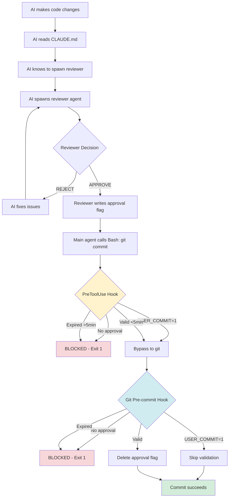

# Reviewer Agent Workflow

## Overview

Every commit requires reviewer agent approval to ensure code quality and compliance with
project standards.

**Three layers are described below, but only one is reliably enforced.** Layer 2, the git
pre-commit hook, is tracked in this repo, runs the full test suite, and is what actually
gates a commit. Layer 1 is untracked (`.claude/` is gitignored), absent from a fresh
clone, and silently disabled by a registration ending in `|| true` or any exit code but 2.
Layer 3 is **behavioural** — instructions to the agent — not programmatic at all.

Treat that as the honest baseline when reasoning about what this system guarantees. This
file is the authoritative description; `.githooks/pre-commit` is the source of truth if
the two disagree.

---

## Three-Layer Enforcement Model

### Layer 1: PreToolUse Hook (Primary Enforcement)

**Location:** `.claude/settings.json` + `.claude/helpers/hook-handler.cjs`

**Trigger:** Before ANY `Bash` tool execution

**What it does:**
- ✅ Intercepts `git commit` **before** it runs
- ✅ Checks for approval flag existence
- ✅ Validates approval timestamp (<5 minutes)
- ✅ Allows `USER_COMMIT=1` bypass
- ✅ Provides clear error messages with instructions

**Implementation:**
```javascript
// In hook-handler.cjs pre-bash handler
if (cmd.includes('git commit')) {
  var userCommit = process.env.USER_COMMIT === '1';

  if (!userCommit) {
    var approvalFile = path.join(process.cwd(), 'reviewer-approved');

    // Check if approval file exists
    if (!fs.existsSync(approvalFile)) {
      console.error('[BLOCKED] No reviewer approval found');
      process.exit(2);   // 2 blocks the tool call; any other code lets it through
    }

    var approvalTime = parseInt(fs.readFileSync(approvalFile, 'utf8').trim(), 10);

    // Without this, NaN >= 300 is false and any garbage authorises a commit
    if (isNaN(approvalTime) || approvalTime <= 0) {
      console.error('[BLOCKED] Approval file is corrupted (invalid timestamp)');
      process.exit(2);
    }

    // Check if approval is fresh (<5 minutes)
    var currentTime = Math.floor(Date.now() / 1000);
    var timeDiff = currentTime - approvalTime;

    if (timeDiff >= 300) {
      console.error('[BLOCKED] Reviewer approval expired');
      process.exit(2);
    }
  }
}
```

**Advantages over pre-commit hook:**
- Catches missing approval **before** git commit starts
- Faster feedback (no git operations initiated)
- Provides clearer, more actionable error messages
- Would catch a `--no-verify` bypass, *if* it is live — see the caveats below; this layer
  is disabled entirely by a registration ending in `|| true`, and by any exit code but 2

### Layer 2: Pre-commit Hook (the layer that actually gates)

**Location:** `.git/hooks/pre-commit`

**Trigger:** After `git commit` starts, before commit is finalized

**What it does** (five checks, in order — read `.githooks/pre-commit`, not this list, if
they disagree):
- ✅ Re-validates the approval flag, and **deletes it immediately** (single-use). Note it
  is deleted in check 1, so a later failure means a fresh review is required.
- ✅ Checks commit size (AI commits only: ≤5 files, ≤500 insertions; `package-lock.json` excluded)
- ✅ **Runs the full suite** — `npm test -- --run`, `npm run lint`, `npm run build`,
  `npm run test:e2e`. Skipped only when every staged file is `.md` or `.txt`.
- ✅ Checks for secrets in staged files
- ✅ Prints an advisory reminder about reviewer oversight (no prompt — nothing reads stdin)

**Why both layers:**
- Layer 2 is the real gate: it is tracked in git, reviewable, and runs the suite
- Layer 1 is faster feedback, but is untracked and easily disabled without anyone noticing
- Layer 2 cleans up the approval flag
- Layer 2 checks secrets (different concern)

### Layer 3: Behavioral (AI Instructions)

**Location:** `CLAUDE.md` and `AGENTS.md`

**What it does:**
- Instructs main agent to always spawn reviewer before committing
- Instructs **reviewer agent** to write `reviewer-approved` on APPROVE (using Write tool)
- Explicitly prohibits main agent from writing `reviewer-approved`
- Requires both agents to surface all actions to the user in chat

**Why still needed:**
- Hooks only validate; they don't trigger the reviewer or write the flag
- AI needs to know WHEN to spawn reviewer and WHAT to do with the result
- Transparency requirement ensures the user can audit the review in real time

**Token ownership:**
The `reviewer-approved` flag is written by the reviewer agent, not the main agent.
This is the integrity separation: the entity that evaluated the code is the same
entity that creates the approval token. The main agent's job is to spawn the
reviewer, wait for it to write the flag, then commit.

---

## Pre-Commit Requirements (Enforced by Hooks)

Before ANY commit is allowed, all of these checks must pass:

### 0. Commit Size (AI commits only — hard block)

The pre-commit hook enforces atomic commit size for AI-generated commits:
- **Max 5 files** staged per commit (`package-lock.json` excluded — always large on dependency changes)
- **Max 500 lines** inserted per commit (`package-lock.json` excluded)

If exceeded, the commit is blocked. Split into smaller atomic commits.

The reviewer agent also checks this and will **REJECT** any staged set exceeding these limits.

`USER_COMMIT=1` is available for the **human's own commits** only — AI agents must never use it.

### 1. Unit Tests
```bash
npm test -- --run
```
**Why:** Validates individual components and functions work correctly in isolation.

### 2. Linter
```bash
npm run lint
```
**Why:** Enforces code style, catches potential bugs, ensures TypeScript types are correct.

### 3. Build Validation
```bash
npm run build
```
**Why:** Ensures production build succeeds, catches build-time errors.

### 4. **E2E Tests (CRITICAL)**
```bash
npm run test:e2e
```
**Why:** Catches runtime errors that unit tests miss:
- Next.js routing conflicts (different dynamic segment names)
- Server startup failures
- Integration issues between components
- Cache invalidation bugs
- Production-mode behavior

**Real example:** The routing conflict bug passed:
- ✅ Unit tests passing (`npm test -- --run`)
- ✅ Linter (0 errors)
- ✅ Build (successful)
- ❌ **E2E tests would have caught:** Server crashed on startup with "different slug names" error

### 5. Reviewer Agent Approval
Spawn reviewer agent to validate changes comply with behavioral requirements.

---

## Complete Flow Diagram


```mermaid
graph TD
    A[AI makes code changes] --> B[AI reads CLAUDE.md]
    B --> C[AI knows to spawn reviewer]
    C --> D[AI spawns reviewer agent]
    D --> E{Reviewer Decision}
    E -->|REJECT| F[AI fixes issues]
    F --> D
    E -->|APPROVE| G[Reviewer writes approval flag]
    G --> H[Main agent calls Bash: git commit]
    H --> I{PreToolUse Hook}
    I -->|No approval| J[BLOCKED - Exit 1]
    I -->|Expired >5min| J
    I -->|USER_COMMIT=1| K[Bypass to git]
    I -->|Valid <5min| K
    K --> L{Git Pre-commit Hook}
    L -->|No approval| M[BLOCKED - Exit 1]
    L -->|Expired| M
    L -->|USER_COMMIT=1| N[Skip validation]
    L -->|Valid| O[Delete approval flag]
    N --> P[Commit succeeds]
    O --> P

    style I fill:#fff3cd
    style L fill:#d1ecf1
    style J fill:#f8d7da
    style M fill:#f8d7da
    style P fill:#d4edda
```

---

## Testing the Enforcement

### Test 1: No Approval (Should Block)

```bash
# Make a change
echo "test" >> README.md
git add README.md

# Try to commit without reviewer approval
git commit -m "test"

# Expected output:
# [BLOCKED] No reviewer approval found
#
# Required before git commit:
#   1. Spawn reviewer agent with Agent tool
#   2. Get APPROVE decision from agent
#   3. Reviewer agent writes the approval flag
#   4. Then commit within 5 minutes
#
# For manual commits: USER_COMMIT=1 git commit -m "message"
```

### Test 2: USER_COMMIT Bypass (Should Allow)

```bash
# Same setup
echo "test" >> README.md
git add README.md

# Commit with bypass
USER_COMMIT=1 git commit -m "test"

# Expected output:
# [OK] User commit (bypassing reviewer)
# [OK] Command validated
# (commit succeeds)
```

### Test 3: Fresh Approval (Should Allow)

```bash
# Create approval flag manually (simulating reviewer)
echo "$(date +%s)" > reviewer-approved

# Try commit
git commit -m "test"

# Expected output:
# [OK] Reviewer approved (2s ago)
# [OK] Command validated
# (pre-commit hook also validates, then deletes flag)
```

### Test 4: Expired Approval (Should Block)

```bash
# Create old approval (6 minutes ago)
echo "$(($(date +%s) - 360))" > reviewer-approved

# Try commit
git commit -m "test"

# Expected output:
# [BLOCKED] Reviewer approval expired (360s old)
#
# Approval is older than 5 minutes.
# Spawn reviewer agent again and get fresh approval.
```

---

## Configuration Files

### `.claude/settings.json`

```json
{
  "permissions": {
    "allow": [
      "Bash(git commit*)",
      "Bash(git add*)",
      "Write(*)",
      "Agent(subagent_type=reviewer)"
    ]
  },
  "hooks": {
    "PreToolUse": [
      {
        "matcher": "Bash",
        "hooks": [
          {
            "type": "command",
            "command": "node .claude/helpers/hook-handler.cjs pre-bash",
            "timeout": 5000
          }
        ]
      }
    ]
  }
}
```

**Critical permissions:**
- `"Write(*)"` - Allows reviewer agent to write approval flag without user prompt. The main agent shares this permission but MUST NOT use it to write `reviewer-approved` directly.
- Must be exactly `"Write(*)"`, not `"Write(.git/**/*)"` (glob matching issue)

### `.claude/helpers/hook-handler.cjs`

See Layer 1 implementation above.

**Key logic points:**
- Checks `cmd.includes('git commit')` to detect commit commands
- Reads `process.env.USER_COMMIT` for bypass
- Uses `fs.existsSync()` to check for approval file
- Compares Unix timestamps for expiration check
- Exits with **`process.exit(2)`** to block. Only exit 2 blocks a `PreToolUse` tool
  call; every other non-zero code is a non-blocking error and the call proceeds. The
  handler used `exit(1)` until 2026-09-02, so it printed `[BLOCKED]` and allowed the
  commit. There is no `exit(1)` left in the handler; unrecognised commands exit 0.

---

## Comparison: Before vs After

### Before (Behavioral Only)

| Check | Enforcement | Timing | Can Bypass |
|-------|-------------|--------|------------|
| Reviewer spawning | AI follows CLAUDE.md | Before staging | Forgetfulness |
| Approval validation | Git pre-commit hook | At commit time | `--no-verify` |
| Expiration check | Git pre-commit hook | At commit time | `--no-verify` |

**Problem:** If AI forgot to spawn reviewer, nothing stopped it until pre-commit hook ran.

### After (Programmatic + Behavioral)

| Check | Enforcement | Timing | Can bypass? |
|-------|-------------|--------|-------------|
| Reviewer spawning | AI follows CLAUDE.md | Before staging | Yes — behavioural only |
| Approval validation | PreToolUse hook | Before git commit starts | Yes — layer may not be installed or live |
| Expiration check | PreToolUse hook | Before git commit starts | Yes — same |
| **Approval re-validation** | **Git pre-commit hook** | **At commit time** | **`--no-verify`** |
| **Full test suite** | **Git pre-commit hook** | **At commit time** | **`--no-verify`** |
| **Commit size cap** | **Git pre-commit hook** | **At commit time** | **`--no-verify`** |
| **Secrets check** | **Git pre-commit hook** | **At commit time** | **`--no-verify`** |

**Nothing here is unbypassable.** `--no-verify` skips every git hook and is already
auto-approved by `Bash(git commit*)` / `Bash(git commit:*)`, so there is no permission
barrier. The improvement over the "before" state is real but narrower than it looks: a
commit missing approval now fails fast with actionable instructions, provided Layer 1 is
installed and exiting 2.

---

## Edge Cases

### What if `.claude/helpers/hook-handler.cjs` is deleted?

- PreToolUse hook won't run (hook file missing)
- Git pre-commit hook still validates — and it is the layer that was doing the real work anyway
- AI will fail to commit and see pre-commit hook error

### What if both hooks are bypassed?

- PreToolUse hook: runs before tool execution, and blocks only when it exits 2 *and* its
  registered command does not swallow the code. A wrapper ending in `|| true` disables it
  entirely — check `.claude/settings.json` before assuming this layer is live.
- Git hook: bypassable with `git commit --no-verify`
- **`--no-verify` is already auto-approved.** `.claude/settings.json` allows
  `Bash(git commit*)` and `.claude/settings.local.json` allows `Bash(git commit:*)` —
  both are prefix wildcards that match it. There is no permission barrier here.

So the honest description is a single enforced layer: the pre-commit hook, requiring a
fresh reviewer-written flag, capping commit size, and failing on the test suite —
bypassable with `--no-verify`.

### What if approval file is corrupted?

**Fixed in the JS handler 2026-09-02.** `parseInt()` returned `NaN`, `NaN >= 300` is
`false`, so the staleness check passed and any garbage in the file authorised a commit.
The handler now rejects with `exit(2)` when the timestamp is `NaN` or `<= 0`.

The shell hook (`.githooks/pre-commit`) fails closed on corruption but still accepts a
**future-dated** timestamp indefinitely — `[ $TIME_DIFF -lt 300 ]` has no lower bound.
Tracked as a follow-up.

---

## Troubleshooting

### "Command validated" but commit still blocked

- PreToolUse hook passed (approval valid)
- Git pre-commit hook failed (different check)
- Check git pre-commit hook output for details

### "Reviewer approved (Xs ago)" but commit blocked later

- Approval was valid when PreToolUse ran
- By the time pre-commit hook ran, >5 minutes had passed
- Solution: Commit faster after approval, or get new approval

### USER_COMMIT=1 doesn't work

- Check: `echo $USER_COMMIT` (must be "1")
- PreToolUse checks `process.env.USER_COMMIT`
- Git hook checks `$USER_COMMIT` shell variable
- Must set for both: `USER_COMMIT=1 git commit -m "msg"`

---

## Security Considerations

### Is USER_COMMIT=1 a security risk?

**No**, because:
- Only bypasses reviewer requirement
- **Does NOT** bypass secrets check
- **Does NOT** bypass dangerous command check
- User still responsible for their own commits

### Can approval file be forged?

**Yes**, but:
- File is at project root (`reviewer-approved`) and gitignored — never committed
- Only affects local commits
- Still blocked if commit attempted >5 minutes later
- Pre-commit hook also validates (two checks)

### What if malicious code modifies hook-handler.cjs?

- The handler is gitignored (`.gitignore:45` ignores all of `.claude/`), so changes affect
  only the local environment
- **Code review would NOT catch an edit to it** — the file is untracked, so it never
  appears in a diff. The earlier claim to the contrary was false, and contradicted the
  gitignore line directly above it.
- The pre-commit hook is the tracked, reviewable layer, and is the actual defense

---

## Future Improvements

> The corruption check that used to head this list is **implemented** — see the
> `isNaN(approvalTime) || approvalTime <= 0` guard in Layer 1 above. The shell hook still
> lacks a *lower* bound on the timestamp, so a future-dated flag never expires; that one
> is still open.

### 1. Configurable Timeout

```javascript
var maxAge = process.env.REVIEWER_APPROVAL_TIMEOUT || 300; // Default 5 minutes
if (timeDiff >= maxAge) {
  console.error('[BLOCKED] Reviewer approval expired');
  process.exit(2);
}
```

### 2. Automatic Reviewer Spawning

```javascript
// When git commit detected without approval, auto-spawn reviewer
if (!fs.existsSync(approvalFile)) {
  console.log('[AUTO] Spawning reviewer agent...');
  // Trigger Agent tool with reviewer prompt
  // Wait for approval
  // Then proceed with commit
}
```

This would make the workflow fully automatic, but requires IPC between hook and Claude Code.

---

## Summary

**Before every commit:**
1. ✅ Unit tests must pass
2. ✅ Linter must pass
3. ✅ Build must succeed
4. ✅ **E2E tests must pass** ← Critical for catching runtime errors
5. ✅ Reviewer agent approves AND writes the `reviewer-approved` flag

**Token ownership — the integrity guarantee:**
- The **reviewer agent** writes `reviewer-approved` on APPROVE (not the main agent)
- The main agent MUST NOT write this file
- The separation ensures the entity that evaluated the code creates the approval token
- Both agents surface all actions to the user in chat for real-time auditing

**What this system actually ensures — one enforced layer:**
- ✅ A commit without a fresh reviewer-written approval flag fails at the pre-commit hook
- ✅ The approval token is written by the reviewer, never self-approved by the main agent
- ✅ The full suite runs at commit time; the reviewer's own run is not trusted
- ✅ Clear, actionable error messages guide the user
- ✅ `USER_COMMIT=1` is respected for human commits
- ⚠️ Layer 1 fails *earlier* than the hook when installed and exiting 2 — but it is
  untracked, so never assume it is present
- ⚠️ `--no-verify` bypasses all of it

See @docs/REVIEWER_SETUP.md for installation instructions.
